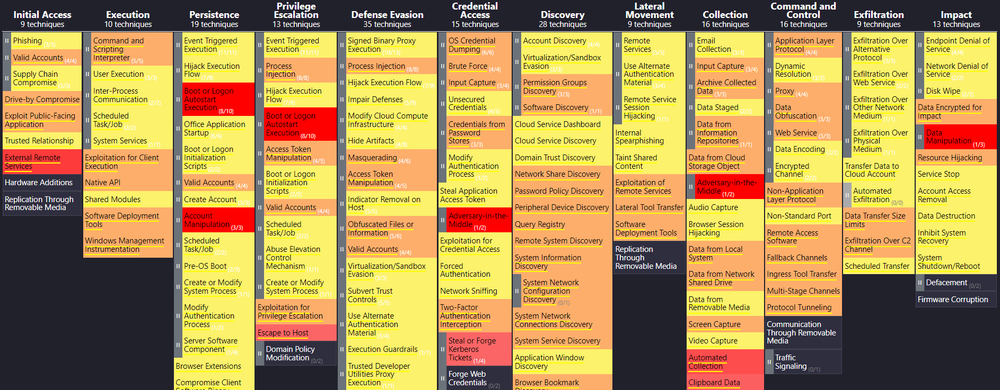
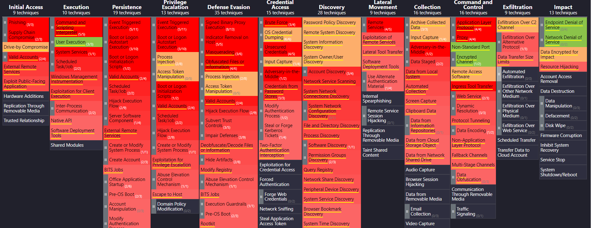

    

In this section you will find the necessary steps to replicate the tests performed following the proposed methodology. The device categories tested are: Smart Personal Assistants, Wearables, and Smart IoT Home Devices. For this purpose, a set of devices from each of these categories have been acquired in such a way that they represent both high and low ranges, and from better known and lesser known brands.
 
 
Each of the tests carried out followed the same procedure applied to the specific use of the device. For example, in SPAs, a mobile device is generally required only during the SPA installation process; while in a wearable, this device is used as an intermediary between the wearable and the home router device (it enables the Wi-Fi connection of the wearable).
 
 
In each of them, the following are presented:
 
 
<ul>
    <li>The tests that are interesting to analyze in the acquired devices.</li>
    <li>The steps to replicate each of the tests.</li>
    <li>The results obtained.</li>
</ul>
    

<a href="https://soniasoleracotanilla.github.io/SPA-Tests/">How to test your SPA »</a>

<a href="https://soniasoleracotanilla.github.io/Wearable-Tests/">How to test your Wearable »</a>

<a href="https://soniasoleracotanilla.github.io/Smart_Home_IoT_Devices-Tests/">How to test your Smart Home IoT Device »</a>

    

(<a href="https://soniasoleracotanilla.github.io/RAYUELA/">Back Home</a>)

    

“MITRE ATT&CK” (MITRE Adversarial Tactics, Techniques and Common Knowledge) is a public database where a wide variety of tactics and techniques are stored based on observations of the real world. This framework allows the understanding of cyber adversary behaviour through the cyber kill chain based on known cybercriminal organizations and their usual targets. This way, MITRE ATT&CK aims for a safer world by solving problems with the whole community developing more effective cybersecurity.
 
 
MITRE presents this data collection through some matrixes that show the techniques and tactics used by attackers in the different phases of the cyber kill chain. Moreover, these techniques and tactics have associated procedures to detect them and recommendations to mitigate their effects.
 
 
Due to the open-access characteristics of “MITRE ATT&CK”, many organizations are contributing to developing new tools for different purposes. The ATT&CK Navigator is a web-based tool for annotating and exploring ATT&CK matrices. Its main uses are visualizing defensive coverage, the frequency of detected techniques, and more. Another relevant tool, developed by the Dutch Bank company Rabobank, is DeTT&CT, which aims to assist cybersecurity teams using ATT&CK to score and compare data log source quality, visibility coverage, detections coverage, and threat actor’s behaviours. All of which can help, in different ways, to get more resilient against attacks targeting an organization.
 
 
Thus, by combining both tools with the information provided by the “MITRE ATT&CK” framework, we obtained two matrixes that show the visibility and detection coverage of the most frequently used techniques by a filtered number of cyber-criminal organizations. The cyber groups selected were focused on the devices we are covering, i.e., SPAs, Smart Home devices, Wearables.
 

## 
## 
  

 
For ease of understanding, the techniques marked in red are frequently used techniques that do not have good visibility or detection coverage. The rest of colours i.e., yellow, orange, green are those techniques with good visibility and detection results that are not frequently used.
 
 
As tens of techniques are described in the “MITRE ATT&CK” framework”, only a few of them related to the tests performed have been selected. The results show whether a technique is often used by a cyber group or not, as well as the visibility and detection coverage of it.
 
 

<a href="https://soniasoleracotanilla.github.io/MITRE_SPA/">Contrasting these results with your SPA »</a>

<a href="https://soniasoleracotanilla.github.io/MITRE_Wearables/">Contrasting these results with your Wearable »</a>

<a href="https://soniasoleracotanilla.github.io/MITRE_Smart_Home/">Contrasting these results with your Smart Home IoT Device »</a>

  

(<a href="https://soniasoleracotanilla.github.io/RAYUELA/">Back Home</a>)

 
## 
    

 
Considering the results obtained and their analysis, we can conclude that, in general, most low-cost devices present a greater amount of security and privacy vulnerabilities. From a security point of view, these low-cost devices lack the authentication and/or encryption means or tools necessary to guarantee the integrity of the devices themselves or the data they handle. For this reason, the privacy of its users is compromised, both due to possible access to sensitive information handled by these devices or because said information is shared through insecure connections with third-party servers. In this way, it is possible to offer a series of recommendations whose objective is to mitigate the detected vulnerabilities. Furthermore, these recommendations are defined with a general application purpose, without discerning the device's type, price, manufacture, or origin.
 
 
First, users must be aware of the information (data) that each device captures during its use. For this, it is necessary, in some cases, to read and understand the privacy policy set by the device or the underlying management application. In addition, it is important to limit the information shared with the applications, giving access only to those data necessary for their operation.
 
 
Second, it is important to use well-configured users to interact with the devices and their management applications. For example, it is interesting to use a different username and password than the usual ones for each application, using key rings to safeguard more complex keys.
From the point of view of configuring the devices, it is important to give them an identifying name and hide their MAC address if possible. A representative name facilitates unequivocal identification by the user for pairing with other devices or the local Internet network. Furthermore, the MAC address hiding prevents some attacks made through this identifier.
 
 
Finally, it is essential to ensure that devices that use voice as a method of interaction can recognise the user. In general, this type of device has the necessary tools to perform this recognition. This operation, together with the possibility of establishing different or non-default activation words, allows for reducing the likelihood that agents, external to the user's environment, can carry out action orders for this type of device.
 
 

(<a href="https://soniasoleracotanilla.github.io/RAYUELA/">Back Home</a>)

   

